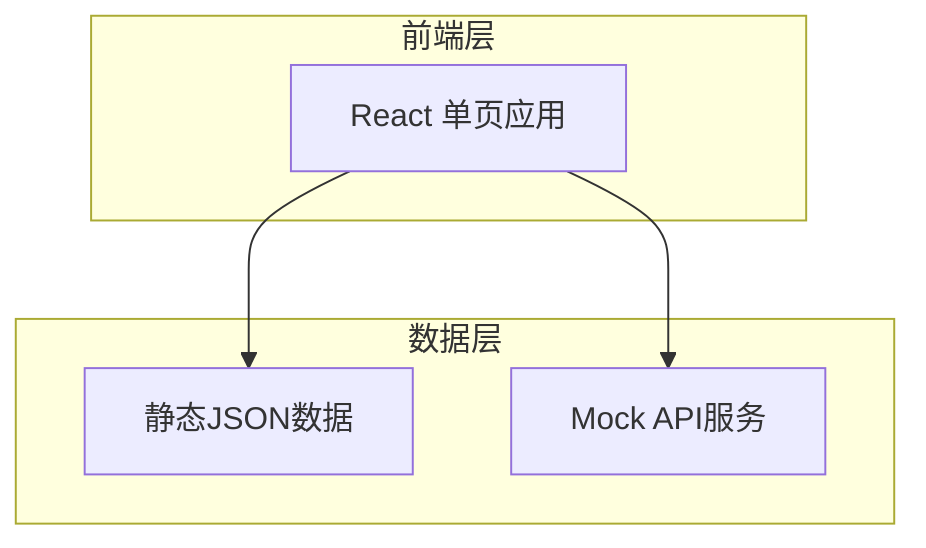

# 成都农村产权交易所官网 - 技术架构文档

## 1. 架构设计

### 1.1 系统架构图


### 1.2 技术选型理由
- **React 18**：组件化开发，生态成熟，性能优秀
- **Vite**：快速构建工具，开发体验好
- **Tailwind CSS**：原子化CSS，快速实现设计稿
- **React Router**：SPA路由管理
- **Framer Motion**：流畅的页面动画

---

## 2. 技术栈详情

| 类别 | 技术 | 版本 |
|------|------|------|
| 框架 | React | 18.x |
| 构建工具 | Vite | 5.x |
| CSS框架 | Tailwind CSS | 3.x |
| 路由 | React Router DOM | 6.x |
| 动画 | Framer Motion | 11.x |
| 图标 | Lucide React | 最新 |

---

## 3. 路由定义

| 路由 | 页面 | 功能 |
|------|------|------|
| / | 首页 | 轮播、数据统计、推荐项目、新闻动态 |
| /about | 关于我们 | 交易所简介、架构、荣誉 |
| /projects | 交易项目列表 | 项目展示、筛选、搜索 |
| /projects/:id | 项目详情 | 完整项目信息、申请入口 |
| /guide | 交易指南 | 流程图、材料清单、FAQ |
| /policies | 政策法规 | 政策文件分类展示 |
| /news | 新闻中心 | 新闻列表、分类 |
| /news/:id | 新闻详情 | 新闻内容 |
| /contact | 联系我们 | 联系方式、留言板 |

---

## 4. 数据结构

### 4.1 项目数据模型
```typescript
interface Project {
  id: string;
  title: string;
  type: '土地经营权' | '林权' | '集体经营性建设用地' | '集体资产' | '农业设施用地' | '其他';
  area: number; // 面积（亩）
  price: number; // 价格（元）
  location: string; // 位置
  district: string; // 区县
  status: '招拍中' | '已成交' | '已下架';
  description: string;
  images: string[];
  publishDate: string;
  contact: {
    name: string;
    phone: string;
  };
}
```

### 4.2 新闻数据模型
```typescript
interface News {
  id: string;
  title: string;
  category: '交易所动态' | '行业资讯' | '通知公告';
  content: string;
  publishDate: string;
  author: string;
  views: number;
}
```

### 4.3 政策数据模型
```typescript
interface Policy {
  id: string;
  title: string;
  level: '国家级' | '省级' | '市级';
  category: string;
  publishDate: string;
  fileUrl?: string;
  summary: string;
}
```

---

## 5. 组件架构

```
src/
├── components/
│   ├── layout/
│   │   ├── Header.jsx        # 顶部导航
│   │   ├── Footer.jsx       # 底部信息
│   │   └── Layout.jsx       # 布局容器
│   ├── common/
│   │   ├── Button.jsx
│   │   ├── Card.jsx
│   │   ├── Input.jsx
│   │   └── SectionTitle.jsx
│   └── modules/
│       ├── HeroCarousel.jsx  # 轮播组件
│       ├── StatsCounter.jsx   # 数据统计
│       ├── ProjectCard.jsx    # 项目卡片
│       ├── NewsCard.jsx       # 新闻卡片
│       ├── FilterBar.jsx     # 筛选栏
│       └── FAQAccordion.jsx  # FAQ手风琴
├── pages/
│   ├── Home.jsx
│   ├── About.jsx
│   ├── Projects.jsx
│   ├── ProjectDetail.jsx
│   ├── Guide.jsx
│   ├── Policies.jsx
│   ├── News.jsx
│   ├── NewsDetail.jsx
│   └── Contact.jsx
├── data/
│   ├── projects.json
│   ├── news.json
│   └── policies.json
├── App.jsx
└── main.jsx
```

---

## 6. 页面结构概览

### 首页布局
```
┌─────────────────────────────────────┐
│            Header 导航              │
├─────────────────────────────────────┤
│         HeroCarousel 轮播           │
├─────────────────────────────────────┤
│        StatsCounter 数据统计        │
├─────────────────────────────────────┤
│     ProjectsSection 推荐项目        │
├─────────────────────────────────────┤
│       NewsSection 新闻动态          │
├─────────────────────────────────────┤
│      PoliciesSection 政策法规        │
├─────────────────────────────────────┤
│             Footer                  │
└─────────────────────────────────────┘
```

---

## 7. 性能优化策略

1. **代码分割**：使用 React.lazy 和 Suspense 进行路由级懒加载
2. **图片优化**：使用 WebP 格式，添加懒加载
3. **缓存策略**：静态资源长期缓存
4. **动画优化**：使用 transform 和 opacity，避免重排重绘

---

## 8. 浏览器兼容

- Chrome 90+
- Firefox 88+
- Safari 14+
- Edge 90+

---

## 9. 可访问性

- 语义化HTML标签
- 适当的ARIA标签
- 键盘导航支持
- 足够的颜色对比度
